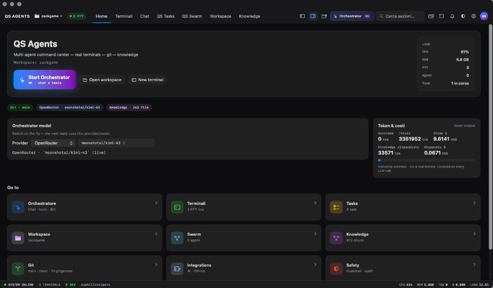

```
  ██████╗ ███████╗     █████╗  ██████╗ ███████╗███╗   ██╗████████╗███████╗
 ██╔═══██╗██╔════╝    ██╔══██╗██╔════╝ ██╔════╝████╗  ██║╚══██╔══╝██╔════╝
 ██║   ██║███████╗    ███████║██║  ███╗█████╗  ██╔██╗ ██║   ██║   ███████╗
 ██║▄▄ ██║╚════██║    ██╔══██║██║   ██║██╔══╝  ██║╚██╗██║   ██║   ╚════██║
 ╚██████╔╝███████║    ██║  ██║╚██████╔╝███████╗██║ ╚████║   ██║   ███████║
  ╚══▀▀═╝ ╚══════╝    ╚═╝  ╚═╝ ╚═════╝ ╚══════╝╚═╝  ╚═══╝   ╚═╝   ╚══════╝
```

**Native macOS command center for multi-agent coding.**

Real PTYs. Real git. Orchestrator chat with tools. Task board, swarm, knowledge, safety rails — **local-first**, keys in Keychain, no QS Agents cloud.

[](https://github.com/Amaraciuri/qsagents/actions/workflows/ci.yml)
[](./LICENSE)
[](./QSAgents)
[](https://github.com/Amaraciuri/qsagents/releases)
[](#contributing)

[Install](#install) · [Quickstart](#quickstart) · [What it is](#what-it-is) · [Features](#features) ·
[Architecture](#architecture) · [Privacy](#privacy--security) · [Develop](#develop) · [Ship](#ship--notarize--sparkle)

---

IDEs give you one agent in a chat pane. **QS Agents** is a **control room**: multiple terminals, an orchestrator that can create/start tasks and call tools, a swarm of coding engines, git/GitHub, and a knowledge layer — all in a notarized native Mac app.

> Free & MIT. Bring your own API keys (OpenRouter, OpenAI, Anthropic, …). Review every patch agents propose.



## Install

**Download (recommended):** notarized Developer ID build from GitHub Releases.

1. Get **[QS-Agents.zip](https://github.com/Amaraciuri/qsagents/releases/download/v1.0.3/QS-Agents.zip)**
2. Unzip → open **QS Agents.app** (Gatekeeper: *Notarized Developer ID*)
3. Onboarding → paste provider keys in **Integrations** (Keychain) → open a workspace

**Updates:** menu **QS Agents → Check for Updates…** (Sparkle). Feed: [`QSAgents/distribution/appcast.xml`](./QSAgents/distribution/appcast.xml).

**From source:**

```bash
git clone https://github.com/Amaraciuri/qsagents.git
cd qsagents/QSAgents
export DEVELOPER_DIR="$(xcode-select -p)"   # or path to Xcode.app/.../Developer
xcodebuild -scheme QSAgents -configuration Debug -derivedDataPath build \
  -destination 'platform=macOS,arch=arm64' build
open "build/Build/Products/Debug/QS Agents.app"
```

## Quickstart

1. **Integrations** — save at least one LLM key (OpenRouter recommended).
2. **Open workspace** — pick your project folder (⌘⇧O).
3. **⌘K** — orchestrator: create a task and start it, or run git / tools.
4. **Terminals** — real PTY panes; agents can mirror tool output there.
5. **Tasks** — board with DAG / progress; DONE only via structured completion.

Example orchestrator goals:

```text
Create ONE task and START it.
Title: Fix boot.css spacing
Detail: only touch src/foundation/boot.css
Model: anthropic/claude-sonnet-4
```

```text
Open a terminal in this workspace and run git status
```

```text
Start the latest task
```

## What it is

| Layer | Role |
|---|---|
| **Orchestrator** | Chat + tools: tasks, git, workspace, coding engines |
| **Agents / Swarm** | LLM sessions with sandbox path tools + optional CLI engines |
| **Terminals** | Real macOS PTYs (not fake consoles) |
| **Tasks** | Kanban + dependencies; truth path for “done” |
| **Workspace** | File tree, editor tabs, unified diffs |
| **Git / GitHub** | Status, stage (incl. force ignored), commit, auth via Keychain |
| **Knowledge** | Local chunks / FTS / project “code brain” |
| **Safety** | Guardrails, confirmations, dry-run; no silent home escape |

### The problems it targets

- *Can I see what the agent is doing in a real shell?*
- *Can several agents work without drowning in one chat thread?*
- *Are API keys leaving my machine into a mystery backend?*
- *Did “task completed” mean evidence — or a lucky Italian substring?*

QS Agents answers those with **local execution**, **structured task completion**, and **Keychain-only secrets**.

## Features

| Area | Status |
|---|:---:|
| Real PTY terminals + agent echo | ✅ |
| Orchestrator modal (⌘K) + tools | ✅ |
| Task board + start from chat | ✅ |
| Workspace sandbox (symlink-safe) | ✅ |
| Git panel + Stage All / force ignored | ✅ |
| GitHub login (device flow) | ✅ |
| Multi-provider LLM (BYOK) | ✅ |
| Swarm / coding engines | ✅ |
| Knowledge + code brain | ✅ |
| Safety guardrails + confirm | ✅ |
| Crash / JSON recovery banners | ✅ |
| XCTest + GitHub Actions CI | ✅ |
| Developer ID notarize + Sparkle | ✅ |
| Tutorials / GDPR / diagnostics export | ✅ |

## Architecture

```
  QS Agents.app (macOS 14+, SwiftUI)
       │
       ├─ OrchestratorEngine ──► LLM (OpenRouter / OpenAI / Anthropic / …)
       │         │                    keys: Keychain only
       │         └─ tools: tasks, git, workspace, agents
       │
       ├─ AgentRuntime + AgentTools ── sandbox paths (WorkspacePathSandbox)
       ├─ TerminalManager ── PTYProcess per session
       ├─ TaskStore ── DAG / columns / complete_task truth
       ├─ GitService ── local git + optional GitHub token
       ├─ KnowledgeStore / ProjectCodeBrain ── on-disk indexes
       └─ SafetyGuardrails ── confirm dangerous shell / LIVE modes

  Data: ~/Library/Application Support/QSAgents/
  Updates: Sparkle ← GitHub appcast + notarized zip
```

App sources live under [`QSAgents/`](./QSAgents/). Tests: `QSAgentsTests/`. Ship scripts: `QSAgents/scripts/`.

## Privacy & security

- **BYOK** — provider keys stay in **Keychain** (never UserDefaults or logs).
- **Second-approval PIN** — salted PBKDF2 in Keychain with attempt lockout (not SHA256 in defaults).
- **Redacted logging** — `AppLogger`, audit trail, Slack/PagerDuty payloads, and diagnostics exports pass through `SecretRedactor`.
- **Agent subprocesses** — agent-launched PTYs and tool shells strip sensitive env vars by default.
- **No QS Agents telemetry** — no phone-home analytics backend.
- **Secret scanning in CI** — [gitleaks](https://github.com/gitleaks/gitleaks) runs on push/PR (`.github/workflows/gitleaks.yml`).
- **GitHub (maintainers)** — enable **Secret Scanning** and **Push Protection** in repo Settings → Code security (must be toggled manually).
- **Release ZIP** — scan distributable builds separately before upload (CI does not scan release assets).

Threat model (honest): QS Agents reduces accidental path escapes and fake “done” states. It does **not** make an LLM safe by magic — review diffs, keep safety on, don’t paste secrets into chat.

## Develop

**Requirements:** macOS 14+, Xcode 15+ (Xcode beta OK if `DEVELOPER_DIR` points at it).

```bash
cd QSAgents
xcodebuild -scheme QSAgents -configuration Debug -derivedDataPath build \
  -destination 'platform=macOS,arch=arm64' test
```

Release smoke (local, no notarize):

```bash
./scripts/ship_check.sh
```

Release docs: [`QSAgents/distribution/README.md`](./QSAgents/distribution/README.md) (Sparkle / appcast loop).

## Ship (notarize + Sparkle)

Maintainers with **Apple Developer Program** + Developer ID:

```bash
export DEVELOPER_DIR="/path/to/Xcode.app/Contents/Developer"
# once: xcrun notarytool store-credentials QSAgents-notary --apple-id … --team-id … --password …
cd QSAgents
NOTARIZE=1 UPLOAD=1 ./scripts/ship_check.sh
ditto -c -k --keepParent \
  "build/Build/Products/Release/QS Agents.app" ~/Desktop/QS-Agents.zip
./scripts/fetch_sparkle_tools.sh
./scripts/make_appcast.sh ~/Desktop/QS-Agents.zip 1.0.2 15
# commit appcast → push main → GitHub Release asset QS-Agents.zip
```

EdDSA **private** key stays in the maintainer Keychain (`generate_keys`). Public key is in `Info.plist` (`SUPublicEDKey`).

## Language (IT / EN)

Settings → **Permissions** or **Support** → **Language / Lingua**:

- **System** — follow macOS
- **Italiano** / **English** — force in-app UI

Strings live in `QSAgents/en.lproj` + `QSAgents/it.lproj` (Italian source keys). Runtime helper: `L("…")` / `AppLanguageStore`.

## Shortcuts

| Shortcut | Action |
|---|---|
| ⌘K | Orchestrator |
| ⌘⇧O | Open workspace |
| ⌘⇧T | New task |
| ⌘N | New terminal |
| ⌘, | Integrations |
| ⌘⇧S | Safety |

## Contributing

PRs welcome for bugs, tests, and docs. Please:

1. Keep **secrets out of git** (keys → Keychain only).
2. Add / update tests when fixing regressions.
3. Don’t commit `build/`, personal IDE folders, or local tooling/index directories.

Security-sensitive reports: open a **private** GitHub advisory or email `privacy@qsagents.app`.

## License

[MIT](./LICENSE) © Euphilia Volpato / Amaraciuri and contributors. Free for personal and commercial use.

---

*QS Agents 1.0.2 — local-first multi-agent command center for macOS.*
